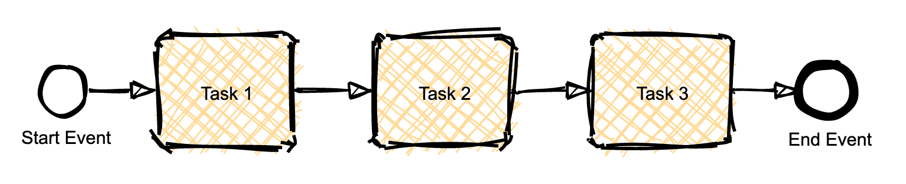
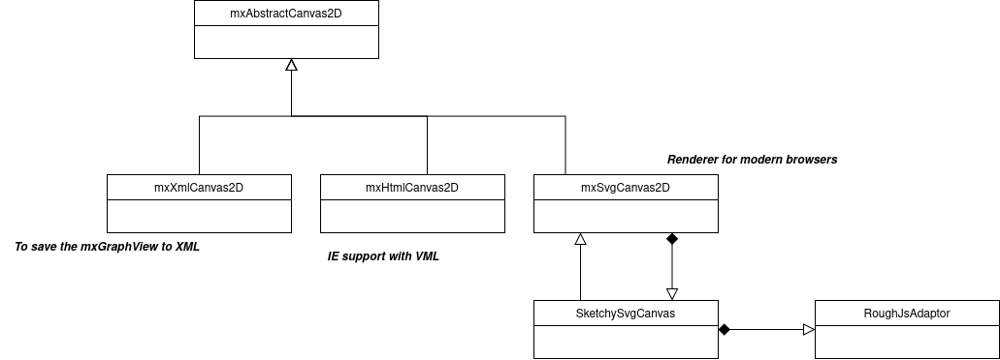

<h1 align="center">MxGraph Sketch</h1> <br>
<p align="center">
    <p align="center">
        
    </p>
    <p align="center">
        <a href="https://github.com/process-analytics/mxgraph-sketch/releases">
             
        </a> 
        <a href="https://github.com/process-analytics/mxgraph-sketch/actions">
             
        </a> 
        <br>
        <a href="CONTRIBUTING.md">
             
        </a> 
        <a href="https://github.com/process-analytics/.github/blob/main/CODE_OF_CONDUCT.md">
             
        </a> 
        <a href="LICENSE">
             
        </a> 
    </p>
</p>


| Archived on 2025-01-17 | We no longer maintain this repository. |
| -------- | -------- |


Used with the [mxGraph](https://github.com/jgraph/mxgraph) library, this library updates the render with a Sketch style.

## 🎨 Features

⚠️ **THIS LIBRARY IS CURRENTLY UNDER DEVELOPMENT** ⚠️ 

This is a demo only.


## 🚢 Build and run locally

Run `npm install` to install the dependencies.

The, run `npm start` to start the development server.


## 🧩 Technical details (from draw.io)

### Technical Analysis: Sketch and Hand Jiggle Implementation

See [Introducing draw.io’s new sketch feature](https://drawio-app.com/introducing-draw-ios-new-sketch-feature/). It leverages [Rough.js](https://roughjs.com/) to create hand-drawn effects. The feature can be applied to the entire graph or specific elements by defining a style. For compatibility, the property names used in draw.io's styles have been retained.

### Key Details of draw.io’s Implementation

- **Style Property**:  
  Draw.io introduces a `sketchStyle` property in its style definitions, which can take the values `'comic'` or `'rough'`. By default, it falls back to `'rough'` if not explicitly set.  
  The visual difference is notable: the `'sketch'` style creates a more pronounced effect than `'comic'`.  
  This behavior was observed by modifying the `sketchStyle` value in draw.io—replacing `sketch=1` with `comic=1`.

- **Canvas Handling**:  
  The `sketchStyle` property determines which type of `handJiggleCanvas` (comic or rough) is created and used for rendering.

- **New Functionality**:  
  A new function, `mxShape.createHandJiggle`, is introduced, as seen in the draw.io codebase:  
  [Relevant code in Editor.js](https://github.com/jgraph/drawio/blob/acd938b1e42cff3be3b629e6239cdec9a9baddcc/src/main/webapp/js/diagramly/Editor.js#L1412).

### draw.io’s Sketch Feature: Implementation Details

1. **New Concept: HandJiggle**
  - This concept introduces hand-drawn effects applied via **canvas**.
  - A new field, `defaultJiggle`, is added to shapes. Default values are set to `1.5` for `mxShape` and `2` for `mxRhombus`.
  - A new `createHandJiggle` function is added to `mxShape`. If the style is set to `sketch`, this function is called.

2. **Testing the Style**:
  - The `jiggle` property defines the "noise" level for sketch effects. This can be tested manually by modifying styles using the “Update Style” button and entering values in the input window.

3. **Comic Mode**:
  - Comic effects are entirely coded manually in a class named `HandJiggle`.
  - This class takes an `mxCanvas` as a parameter and performs additional actions for rendering.

### Rough.js and Fill Styles

When using Rough.js for sketch effects, specific styles can be applied to **fills**, showcasing various visual options.  
In the `Editor` class, the supported fill styles are defined as follows:

```javascript
/**
 * All fill styles supported by rough.js.
 */
Editor.roughFillStyles = [
  {val: 'auto', dispName: 'Auto'},
  {val: 'hachure', dispName: 'Hachure'},
  {val: 'solid', dispName: 'Solid'},
  {val: 'zigzag', dispName: 'ZigZag'},
  {val: 'cross-hatch', dispName: 'Cross Hatch'},
  {val: 'dots', dispName: 'Dots'},
  {val: 'dashed', dispName: 'Dashed'},
  {val: 'zigzag-line', dispName: 'ZigZag Line'}
];
```

This allows for showcasing custom fill effects, such as colorized fills, which are visually appealing.

### Adapter for Rough.js Integration

1. **RoughCanvas Adapter**:  
   A new adapter, `RoughCanvas`, is introduced to handle calls to Rough.js. It converts mxGraph styles to Rough.js styles.  
   For example, the `jiggle` property is transformed into `roughness` for Rough.js.

2. **SVG Canvas Integration**:  
   An implementation extends `mxSvgCanvas2D` to proxy an `mxCanvas`. This implementation delegates certain rendering tasks to `RoughCanvas` when needed.


## 🛠️ Technical details about the implementation of `mxgraph-sketch`

This implementation is inspired by **draw.io's sketch feature** and uses the same style properties to ensure potential compatibility with draw.io.

The `src/mxgraph-sketch.ts` file provides functions to override certain prototypes and add support for the sketch style by applying a dedicated `mxSvgCanvas2D`.

A specialized `SketchySvgCanvas` (extending `mxSvgCanvas2D`) is responsible for enabling the sketch style. It recalculates paths and applies sketchy effects to the rendering.

The concept of **`passThrough`** is introduced to manage styles seamlessly, whether the sketch style is enabled or not.




## 🔧 Contributing

To contribute to `mxgraph-sketch`, fork and clone this repository locally and commit your code on a separate branch. 

The repository contains configuration for [Eclipse Theia](https://theia-ide.org/) and [gitpod.io](https://www.gitpod.io/).

You can find more detail in our [Contributing guide](CONTRIBUTING.md). Participation in this open source project is subject to a [Code of Conduct](https://github.com/process-analytics/.github/blob/main/CODE_OF_CONDUCT.md).

✨ A BIG thanks to all our contributors 🙂


## 📃 License

`mxgraph-sketch` is released under the [Apache 2.0](LICENSE) license. \
Copyright &copy; 2020, Bonitasoft S.A.

Thanks to [Roughjs](https://github.com/rough-stuff/rough) (MIT License) for the sketch style.
