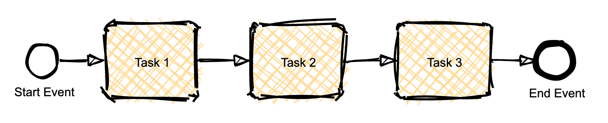

<h1 align="center">MxGraph Sketch</h1>  

    

        
    

    

         
         
         
         
         
         
    

Used with the [MxGraph](https://github.com/jgraph/mxgraph) library, this library updates the render with a Sketch style.

## 🎨 Features

:warning: **THIS LIBRARY IS CURRENTLY UNDER DEVELOPMENT** :warning: 

## 🔧 Contributing

To contribute to `mxgraph-sketch`, fork and clone this repository locally and commit your code on a separate branch. 

The repository contains configuration for [Eclipse Theia](https://theia-ide.org/) and [gitpod.io](https://www.gitpod.io/).

You can find more detail in our [Contributing guide](CONTRIBUTING.md). Participation in this open source project is subject to a [Code of Conduct](https://github.com/process-analytics/.github/blob/main/CODE_OF_CONDUCT.md).

:sparkles: A BIG thanks to all our contributors :slightly_smiling_face:

## 📃 License

`mxgraph-sketch` is released under the [Apache 2.0](LICENSE) license. \
Copyright &copy; 2020, Bonitasoft S.A.

Thanks to [Roughjs](https://github.com/rough-stuff/rough) (MIT License) for the sketch style.
